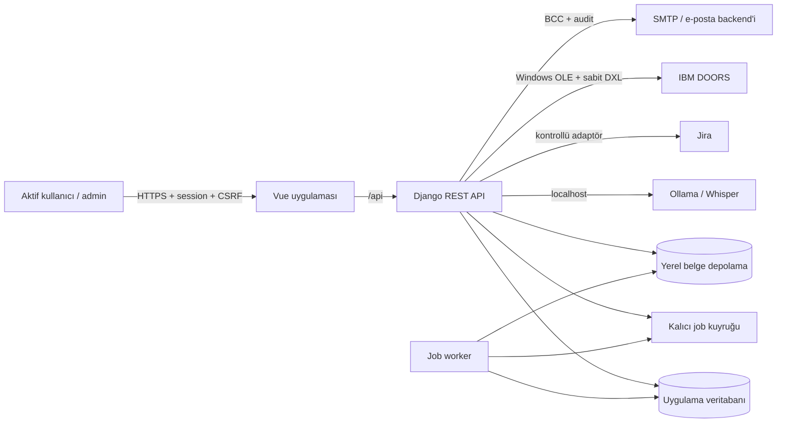
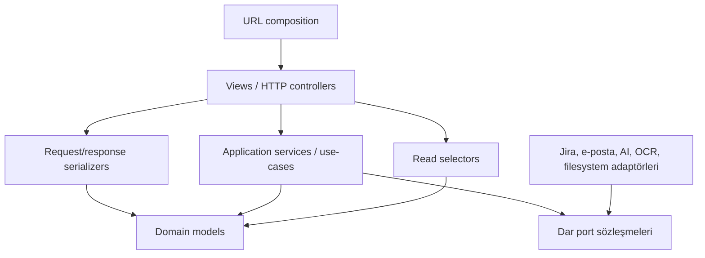
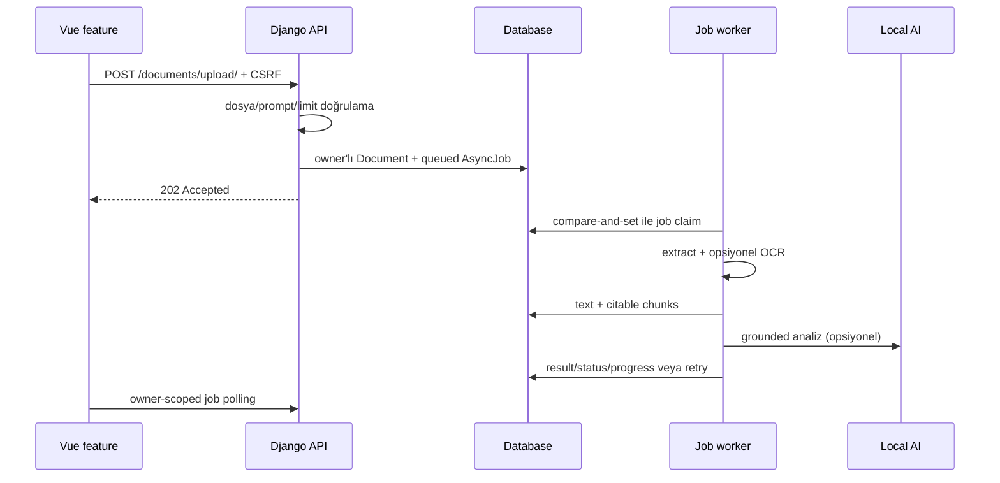

# UAV Center Yazılım Mimarisi

Bu belge UAV Center'ın teknik sınırlarını, bağımlılık yönünü ve yeni özelliklerin
hangi katmana yerleştirileceğini tanımlar. Kodlama ve teslim kuralları için kök
[`AGENTS.md`](../AGENTS.md) dosyası bağlayıcıdır.

## 1. Mimari hedefler

- Yerel ve hassas belge işleme varsayılanını korumak.
- Yetkilendirme, veri sahipliği ve dış sistem yan etkilerini açık sınırlara almak.
- Özelliklerin birbirinden bağımsız geliştirilebildiği modüler bir monolith sunmak.
- Django ve Vue framework ayrıntılarının iş kurallarına yayılmasını önlemek.
- Uzun süren işleri dayanıklı ve yeniden denenebilir arka plan işlerine dönüştürmek.
- Her değişikliği otomatik test, statik kontrol ve production build ile doğrulamak.

Mikroservis, dağıtık transaction veya ayrı bir mesaj broker'ı bugünkü ölçek için
hedef değildir. Yeni altyapı ancak ölçülmüş kapasite veya bağımsız deployment
gereksinimi doğduğunda değerlendirilir.

## 2. Sistem bağlamı



Tarayıcı Ollama, Jira, DOORS, SMTP veya dosya sistemine doğrudan erişmez. Kimlik,
CSRF, doğrulama, timeout ve audit sınırı Django API'dir.

## 3. Backend: feature-first modular monolith

Tek Django app-label'ı `api` olarak kalır. Bu karar mevcut tablo adlarını,
content-type kayıtlarını ve migration geçmişini korurken kodun domain paketlerine
ayrılmasına izin verir.

```text
backend/api/
├── common/                 ortak izin ve HTTP altyapısı
├── accounts/               oturum, kayıt ve kullanıcı yönetimi
├── documents/              belge, parça, RAG ve analiz kontrolleri
├── jobs/                   kalıcı kuyruk, sahiplik ve durum geçişleri
├── ai/                     AI API sözleşmesi ve sağlayıcı sınırı
├── organization/           proje, panel, kişi ve gruplar
├── technical_documents/   teknik doküman yaşam döngüsü ve bildirim
├── operational_alerts/    teknik doküman ve uçuş izni salt-okunur uyarı projeksiyonu
├── form_processes/         FM/uçuş izni kataloğu, dinamik kayıtlar, ekler ve Word üretimi
├── edk/                    EDK başvuru, onay, tutanak ayrıştırma ve Jira yayın akışı
├── services/               cross-feature belge/AI/job işleme ve dış adaptör yüzeyleri
├── models.py               Django discovery için açık re-export façade
├── serializers.py          açık re-export façade
├── views.py                açık re-export façade
└── urls.py                 yalnız URL composition
```

Façade dosyaları yeni iş kuralı barındırmaz. Yeni kod doğrudan ait olduğu feature
paketine eklenir.

İzin verilen cross-feature yönleri `documents → jobs`,
`technical_documents → organization`, `edk → organization` ve
`operational_alerts → technical_documents/form_processes` yönleridir. Bunlar
ingestion/job response, kurumsal read-model, sorumlu eşleme ve salt-okunur uyarı
projeksiyonu use-case'leri için dar public model/selector/service yüzeyleriyle
kullanılır; ters bağımlılık veya döngü kurulmaz. Root compatibility façade'ları
production kodunun bağımlılığı değildir ve bu kural mimari testle korunur.

### 3.1 Bağımlılık yönü



Kurallar:

- View yalnız HTTP çevirisi, izin, doğrulama ve response mapping yapar.
- Serializer taşıma biçimini ve yerel alan kurallarını doğrular.
- Selector görünürlük, filtre, `select_related` ve `prefetch_related` kararlarını
  tek yerde toplar.
- Application service transaction, durum geçişi, audit ve use-case orkestrasyonunu
  yönetir; `HttpRequest` veya DRF `Response` almaz.
- Port mümkün olan en küçük `Protocol`/callable sözleşmesidir.
- Adapter dış kütüphane, HTTP/OLE, timeout, TLS ve hata normalizasyonunu kapsar.
- Model DRF, request veya dış sağlayıcı import etmez.

### 3.2 Veri sahipliği

Uygulama karma görünürlük modeline sahiptir:

| Kaynak                                        | Görünürlük                                                                                          |
| --------------------------------------------- | --------------------------------------------------------------------------------------------------- |
| Belge                                         | Sahibi; staff tüm kayıtlar ve owner bilgisini denetler                                              |
| Job ve özel analiz kontrolü                   | Yalnız sahibi                                                                                       |
| Belge analiz geçmişi                          | Sahibi; staff görünür belgelerin tüm geçmişini denetler                                             |
| Organizasyon ve teknik doküman okuma          | Aktif kullanıcılar                                                                                  |
| Organizasyon ve teknik doküman yazma/bildirim | Staff; bildirim body/alıcı/hata ayrıntısı staff-only                                                |
| Mühendislik form süreçleri ve uçuş izinleri   | Paylaşımlı operasyonel kayıtlar; şablon kodu, alan şeması ve ek dosya backend tarafından doğrulanır |
| Operasyonel uyarı projeksiyonu                | Aktif kullanıcılar; bildirim eylemi ve alıcı bilgileri mevcut staff sınırında kalır                 |
| Jira yayın ve model yönetimi                  | Staff veya açıkça tanımlı özel izin                                                                 |

Sahiplik uygulanan nesneler görünür queryset üzerinden alınır. Yabancı kimliği
URL'de bilen kullanıcıya `404` dönülür; frontend gizleme güvenlik sayılmaz.

### 3.3 Belge ve job akışı



Handler'lar yeniden çalıştırılabilir olmalı; retry mükerrer dış yan etki
üretmemelidir. Çoklu worker semantiği SQLite dışındaki satır kilitlemeli üretim
veritabanlarında da doğru kalmalıdır.

## 4. Frontend: app → feature → shared

Frontend state'in çoğu route ömrüne bağlıdır. Bu nedenle global store yerine tek
uygulama API/session context'i ve feature-owned page controller'ları kullanılır.
Bu bölüm hedef yönü ve tamamlanan composition sınırını tanımlar. Organizasyon,
teknik dokümanlar ve mühendislik formları feature-owned bileşen/composable'lara
ayrılmıştır. Uçuş izni şablonları ayrı bir frontend feature değildir; aynı form
kataloğu ve editör akışında çalışır. Admin, AI Studio, belge işleme, job, sistem ve Word-to-Jira route
orkestrasyonu feature page'lerinde olsa da bazı paylaşılan root view/composable
implementasyonları kademeli taşıma yüzeyi olarak sürmektedir; yeni davranış bu
legacy yüzeyi büyütmez.

Naive UI global registry'si yalnız template'lerde gerçekten kullanılan
bileşenleri içerir; registry ile `<n-*>` kullanımlarının birebir eşleşmesi Vitest
ile korunur. Böylece tüm UI kütüphanesi başlangıç bundle'ına taşınmaz.

```text
frontend/src/
├── app/               bootstrap, context, shell ve navigation
├── features/          route page, model, controller/composable ve dar bileşenler
├── components/        gerçek anlamda uygulama-geneli paylaşılan UI parçaları
├── composables/       paylaşılan transport/session ve compatibility re-export'ları
├── views/             taşınmış ekranlar için ince compatibility façade'ları
├── styles/            token/base, app shell, feature ve responsive stil modülleri
├── router/            lazy route composition
├── App.vue            provider + auth shell + RouterView
├── style.css          yalnız sıralı CSS import composition façade'ı
└── main.js            uygulama composition root'u
```

Bağımlılık yönü `main/app/router → feature → paylaşılan transport/UI` şeklindedir.
Bir feature başka bir feature'ın iç dosyasını import etmez. Paylaşılan bir okuma
modeli gerçekten ikinci kullanıcıya ulaştığında genel composable/component
sınırına çıkarılır; spekülatif `shared` katmanı oluşturulmaz.

Her route page kendi composable'ını kurar, ilk veriyi yükler ve unmount sırasında
polling, fetch veya stream kaynaklarını temizler. `App.vue` route adına göre prop ve
listener üreten switch blokları içermez.

### 4.1 HTTP ve session

- Tek uygulama-scoped client session cookie ve CSRF state'ini yönetir.
- Eşzamanlı CSRF istekleri tek promise üzerinde birleştirilir.
- Standart feature'lar doğrudan `fetch` çağırmaz.
- Stream gibi özel transport, aynı URL/CSRF/credentials sınırını yeniden kullanır.
- Her istek `AbortSignal` kabul edebilir.
- Logout, kullanıcıya ait route state'ini component unmount ile temizler.

### 4.2 Navigasyon

- Route component'leri lazy import edilir.
- Menü tanımı router implementation'ından ayrıdır.
- Admin meta kontrolü erken UX yönlendirmesi sağlar; gerçek izin backend'dedir.
- Bir nesneye geçiş query/path kimliğiyle deep-link üretir; gizli global store
  referansına dayanmaz.

## 5. Güvenlik sınırları

- Production başlangıcı güçlü secret, kapalı debug, wildcard içermeyen explicit
  host ve güvenli cookie/HTTPS/HSTS ayarları olmadan fail-fast olmalıdır.
  Browser/Jira originleri tanımlanırsa HTTPS zorunludur; boş origin listesi güvenli
  same-origin deployment sözleşmesidir.
- Production, teslimat yapmayan geliştirme e-posta backend'leriyle başlamaz ve
  DRF browsable HTML renderer'ını sunmaz.
- Her response izlenebilir bir request ID taşır; loglar belge/prompt/hücre/e-posta
  gövdesi veya token içermez.
- Operator tarafından verilen outbound URL'ler yalnız HTTP(S), credentials içermeyen
  biçimde kabul edilir; API/provider hata ayrıntıları ortak redaction sınırından geçer.
- AI URL'leri varsayılan loopback/private host sınırındadır. Uzak servis açık opt-in
  gerektirir; production'da HTTPS ve veri sınıflandırması onayı zorunludur.
- Upload uzantı ve toplam boyuta ek olarak OOXML zorunlu parçaları, arşiv öğesi ve
  açılmış boyut, PDF sayfa, görsel kare/piksel sınırlarıyla yan etkiden önce
  doğrulanır; worker aynı sınırları defense-in-depth olarak yeniden uygular.
- OCR model indirmesi ve AI tool execution varsayılan kapalıdır.
- Belge içeriği ve prompt güvenilmeyen veridir; model sistem talimatına dönüşmez.
- Jira/e-posta/DOORS gibi dış yan etkiler özel izin, timeout, audit ve idempotency
  gerektirir. Teknik doküman bildirimi DB benzersiz `Idempotency-Key` claim'iyle
  aynı request replay'ini engeller. SMTP gönderimi ile başarı audit commit'i
  arasındaki crash penceresi mutlak exactly-once değildir; zaman aşan `pending`
  kayıt `unknown` olur ve uzlaştırılmadan yeni anahtarla tekrar gönderilmez.
- DOORS adaptörü yalnız sabit DXL dispatch sunar; dinamik DXL ve hard-delete yoktur.

## 6. Gözlemlenebilirlik

Application logları stdout'a yazılır. Production JSON log alanları:

```text
timestamp, level, logger, event, message, request_id,
user_id, job_id, document_id, duration_ms
```

Beklenmeyen exception logu yalnız exception türü ile dosya adı/fonksiyon/satırdan
oluşan sınırlı frame metadata'sını taşır; exception payload'ı, source line ve mutlak
yol formatter sınırında atılır. Dış sağlayıcı/dosya hataları güvenli event ve hata
sınıfıyla loglanır. `/api/health/`
liveness uygulama sürecini; `/api/health/ready/` ise yalnız DB `SELECT 1` ile zorunlu
kalıcılığı kontrol eder. Opsiyonel Ollama/Jira/DOORS erişilemezliği temel API
readiness'ini düşürmez.

## 7. Kalite kapıları

Her değişiklik riskine göre aşağıdaki kapılardan geçer:

```text
Backend: formatter/lint → Django check → migration drift → tests → deploy check
Frontend: formatter/lint → unit tests → production build
Security: dependency audit → secret ve production-settings kontrolü
```

Gerçek komutlar root `AGENTS.md`, `CONTRIBUTING.md`, backend dependency manifestleri
ve frontend `package.json` script'lerinde tanımlıdır. CI ile yerel komutların aynı
yüzeyi çağırması esastır.

## 8. Evrim kuralları

Yeni bir feature için sıralama:

1. Sahiplik, roller, veri sınıflandırması ve dış yan etkileri tanımla.
2. Request/response ve hata sözleşmesini yaz.
3. Domain modeli, selector ve use-case sınırını belirle.
4. Gerekli dış bağımlılık için dar port ve fake oluştur.
5. Backend negatif yetki ve use-case testlerini ekle.
6. Feature page/controller ve sunumsal bileşenleri oluştur.
7. Operasyon, audit ve dokümantasyonu tamamla.

Bir modülü ayrı servise çıkarmak ancak bağımsız deployment/ölçek, farklı güven
sınırı veya ekip sahipliği bunu gerektiriyorsa değerlendirilir. Çıkarma öncesi port
zaten uygulama içinde kararlı olmalıdır.

## 9. İlgili mimari kararlar

- [ADR-0001: Feature-first modular monolith](adr/0001-feature-first-modular-monolith.md)
- [ADR-0002: Local-first dış sistem adaptörleri](adr/0002-local-first-adapters.md)
- [ADR-0003: Kalıcı veritabanı job kuyruğu](adr/0003-durable-job-queue.md)
- [ADR-0004: Belge sahipliği, denetim ve retention](adr/0004-document-ownership-and-retention.md)
